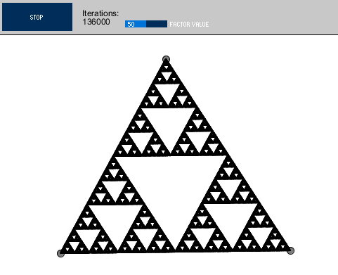
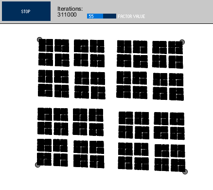
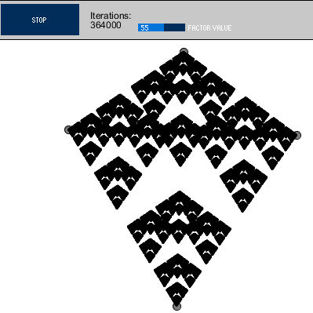

# Fractal visualizer

Simple fractal visualizer written in Processing 3, inspired by [Chaos Game video by Numberphile](https://www.youtube.com/watch?v=kbKtFN71Lfs)

To run this use [Processing sketchbook](https://processing.org/). GUI uses [ControlP5 library](http://www.sojamo.de/libraries/controlP5/)

## How it works?

Numberphile video linked above explains it better than I could

## What can I do with it?

You can visualize some cool fractals with it. Click a few times to create vertices, then hit "Start" button to generate a fractal basing on your input. Examples:

